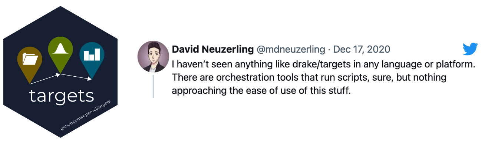

<style>
.inverse {
background-color: transparent;
text-shadow: 0 0 0px transparent;
}
.title-slide {
vertical-align: bottom !important; 
text-align: center !important;
}
.title-slide h1 {
position: absolute;
top: -50px;
left: 0;
right: 0;
width: 100%;
line-height: 4em;
color: #666666;
}
.title-slide h2 {
position: absolute;
top: 0px;
right: 0;
left: 0;
line-height: 6em;
color: #666666;
}
.title-slide h3 {
position: absolute;
top: 400px;
right: 0;
left: 0;
line-height: 6em;
color: #666666;
}
.title-slide {
background-color: white;
background-image: url('images/gittargets.png');
background-repeat: no-repeat;
background-size: 25%;
background-position: 25px 0px 0px 0px;
}
.remark-slide-content:after {
content: "Copyright Eli Lilly and Company";
position: absolute;
bottom: -5px;
left: 20px;
height: 40px;
width: 100%;
font-family: Helvetica, Arial, sans-serif;
font-size: 0.7em;
color: #666666;
background-repeat: no-repeat;
background-size: contain;
}
</style>

```{r, include = FALSE, echo = FALSE}
set.seed(0)
suppressPackageStartupMessages({
  library(gittargets)
  library(targets)
})
knitr::opts_chunk$set(
  cache = FALSE,
  comment = "#>",
  fig.width = 10, 
  fig.height = 5
)
```

# Demanding computation in R

* **Bayesian data analysis: JAGS, Stan, NIMBLE, `greta`**
* Deep learning: `keras`, `tensorflow`, `torch`
* Machine learning: `tidymodels`
* PK/PD: `nlmixr`, `mrgsolve`
* Clinical trial simulation: `rpact`, `Mediana`
* Statistical genomics
* Social network analysis
* Permutation tests
* Database queries: `DBI`
* Big data ETL

???

This talk is about data version control for the targets R package.

A lot of work that happens in R is computationally demanding. Everything from machine learning to Bayesian statistics to ETL.

---

# Typical notebook-based project


???

It's common practice to manage the complexity of a project in a sequence of numbered scripts or notebooks. These notebooks run one by one, each notebook writes its own set of output files, and the output files of one notebook become the input files of the next notebook.

---

# The complicated reality


???

But for anything even a little bit complicated, this approach breaks down. You have to interrupt the linear sequence of notebooks in order to add steps. Intermediate files are cumbersome to micromanage, the code files get messy. And if you want to run tasks in parallel, it gets even messier. It's far too easy to lose track of what you're doing, and the end product is not computationally reproducible.

---

# Pipeline tools


* Orchestrate moving parts.
* Scale the computation.
* Manage output data.
* <span style="color: #ee6600; font-weight: bold;">Manage historical output data</span>.

???

Pipeline tools solve these problems. A pipeline tool orchestrates the overall flow of tasks from beginning to end, running the correct steps in the correct order, and if the compute resources allow on your platform, conditionally independent tasks can run in parallel. And for most pipeline tools, output data is managed behind the scenes. So for each task, you can trust that all the requisite data files are available in the right place.

Some pipeline tools even manage *historical* output, meaning they hold onto output data from pipeline from runs in the past, and that's actually where I'm going to go with this talk.

---

<br>



<br>

* Designed for R.
* Encourages good programming habits.
* Automatic dependency detection.
* Behind-the-scenes data management.
* Distributed computing.

???

First, the {targets} R package. Most pipeline tools try to be language-agnostic, and this is why {targets} stands out. {targets}, unlike most of its peers, works *within* the language. You can write complex pipelines that scale, but what you're doing as a user still looks and feels like you're just using R: everything from the abstraction of files as R objects, to the way you can dynamically branch over dplyr groups or rows of a data frame, to integration with {knitr} and R Markdown.

And how it works is you write ordinary functions to prepare data and run models (which is a good practice anyway), you declare tasks that call those functions (those will be your targets, the steps of the computation), and then the {targets} package actually runs the project. It automatically knows which tasks depend on which other tasks, how to run those tasks in parallel, and how to store the data.

---

# Example pipeline

```{r, eval = FALSE}
# _targets.R file (get started with use_targets())
library(targets)
library(tarchetypes)
tar_option_set(packages = c("keras", "tidymodels"))
options(clustermq.scheduler = "multisession") # clusters too
source("R/custom_functions.R")

list(
  tar_target(raw_data, "raw_data_file.csv", format = "file"),
  tar_target(tidy_data, munge_data(raw_data), format = "parquet"),
  tar_target(bayesian_model, run_bayesian_model(tidy_data)),
  tar_target(random_forest, run_random_forest(tidy_data)),
  tar_target(deep_neural_net, run_dnn(tidy_data)),
  tar_target(plot_bayes, vis_bayes(bayesian_model)),
  tar_target(plot_rf, vis_rf(random_forest)),
  tar_target(plot_dnn, vis_dnn(deep_neural_net)),
  tar_render(markdown_report, "report.Rmd")
)
```

???

On to how to get started. To use {targets}, you create what's called a targets file (or target script) which is just an R script that brings together the different components of the project. The use_targets() function actually writes a template targets file for you, and all you do is follow the comments and fill in the blanks. When you're done, it will look something like this. So first at the top, you declare packages, options, settings, and functions, just as if you were setting up an ordinary R session for an ordinary project. And then at the end of the file, you declare a list of tasks, or "targets", that run when the project runs. Each target has a command, which is bit of R code that calls your functions, and a name, which is a symbol. When the target runs, the command also runs, and the return value is assigned to the name. At that point, the target looks and feels like an ordinary variable in R, but it's stored as a file in a safe place.

---

# tar_visnetwork()


???

Remember that nice graph from a couple slides ago? {targets} automatically generates it with the tar_visnetwork() function. The graph describes the progression of the pipeline in a natural left-to-right flow, and it shows which targets are already up to date and which targets are out of sync with the code and data they depend on. In this graph, one model is up to date, and the others need a refresh.

---

# Run the pipeline

```{r, eval = FALSE}
tar_make_clustermq(workers = 2)
#> ✓ skip target raw_data
#> ✓ skip target tidy_data
#> ✓ skip target deep_neural_net
#> • start target bayesian_model
#> • start target random_forest
#> ✓ skip target plot_dnn
#> • built target bayesian_model
#> • start target plot_bayes
#> • built target random_forest
#> • start target plot_rf
#> • built target plot_bayes
#> • built target plot_rf
#> • end pipeline: 30.02 minutes
```

???

When you run the pipeline, the correct targets run in the correct order - in this case, distributed over two parallel processes (maybe two jobs on a cluster) - and the output data is sent to storage. The deep neural net is automatically skipped because it's already up to date, and the other two models automatically run to get back in sync with their upstream dependencies. And if *those* models change, the downstream targets will run as well. This selective skipping and running is an *enormous* time saver, and it creates a peace of mind that you don't know you need until you feel it for the first time. And that's what {targets} cares about.

---

# Other pipeline tools

* Many exist: https://github.com/pditommaso/awesome-pipeline
* Different tools have different features and tradeoffs.


* {[gittargets](https://docs.ropensci.org/gittargets/)} and [cloud integration](https://books.ropensci.org/targets/data.html#cloud-storage) manage historical data for {[targets](https://docs.ropensci.org/targets/)}.

???

But different pipeline tools care about different things. {targets} is a lot like GNU Make, a classic pipeline tool from decades ago, which only cares about the current state of the project and skips tasks that are already up to date. But Apache Airflow is another key player in this ecosystem, and its priorities are totally different. Airflow cares about data pipelines that run on a regular schedule, need to run end-to-end from scratch every time, and need a complete historical record of all past results. Those features are valuable too, but they weren't always supported in {targets} by itself.

---

# Data access in {targets}

```{r, eval = FALSE}
tar_read(tidy_data)
#> # A tibble: 7,043 × 21
#>    customerID gender SeniorCitizen Partner Dependents tenure PhoneService
#>    <chr>      <chr>          <dbl> <chr>   <chr>       <dbl> <chr>       
#>  1 7590-VHVEG Female             0 Yes     No              1 No          
#>  2 5575-GNVDE Male               0 No      No             34 Yes         
#>  3 3668-QPYBK Male               0 No      No              2 Yes         
#>  4 7795-CFOCW Male               0 No      No             45 No          
#>  5 9237-HQITU Female             0 No      No              2 Yes         
#>  6 9305-CDSKC Female             0 No      No              8 Yes         
#>  7 1452-KIOVK Male               0 No      Yes            22 Yes         
#>  8 6713-OKOMC Female             0 No      No             10 No          
#>  9 7892-POOKP Female             0 Yes     No             28 Yes         
#> 10 6388-TABGU Male               0 No      Yes            62 Yes         
#> # … with 7,033 more rows, and 14 more variables: MultipleLines <chr>,
#> #   InternetService <chr>, OnlineSecurity <chr>, OnlineBackup <chr>,
#> #   DeviceProtection <chr>, TechSupport <chr>, StreamingTV <chr>,
#> #   StreamingMovies <chr>, Contract <chr>, PaperlessBilling <chr>,
#> #   PaymentMethod <chr>, MonthlyCharges <dbl>, TotalCharges <dbl>, Churn <chr>
```

???

And that has to do with how {targets} stores its data. If you've used {targets} before, you probably know about the tar_read() function, which takes the file of a target that already ran and brings it back into the R session.

---

# {targets} data store

```{r, eval = FALSE}
fs::dir_tree("_targets")
#> _targets
#> ├── meta
#> │   ├── meta
#> │   ├── process
#> │   └── progress
#> ├── objects
#> │   ├── bayesian_model
#> │   ├── deep_neural_net
#> │   ├── plot_bayes
#> │   ├── plot_dnn
#> │   ├── plot_rf
#> │   ├── random_forest
#> │   ├── raw_data
#> │   └── tidy_data
#> └── user
```

???

The {targets} data store is a folder that looks like this. Behind the scenes, tar_read() is going into this folder and looking in the "objects" subfolder for the actual data. The data could be a serialized R data file, or RDS file, or it could be another format like feather or parquet. To learn what format it has and how to read it, tar_read() first looks at the metadata file in the "meta" folder, and *then* goes and reads the object.

---

# {targets} metadata

```{r, eval = FALSE}
tar_meta() # reads _targets/meta/meta
#> # A tibble: 8 × 18
#>   name     type  data  command depend    seed path  time                size  bytes format
#>   <chr>    <chr> <chr> <chr>   <chr>    <int> <lis> <dttm>              <chr> <int> <chr> 
#> 1 bayesia… stem  df47… 2d2dc8… f3915…  7.53e8 <chr> 2022-05-11 14:38:15 9294…  1276 rds   
#> 2 deep_ne… stem  df47… 2d2dc8… f3915… -2.15e8 <chr> 2022-05-11 14:37:17 9294…  1276 rds   
#> 3 plot_ba… stem  df47… ac4f51… 0a2b8…  1.70e9 <chr> 2022-05-11 14:38:15 9294…  1276 rds   
#> 4 plot_dnn stem  df47… 8782dd… 93270… -1.97e9 <chr> 2022-05-11 14:37:17 9294…  1276 rds   
#> 5 plot_rf  stem  df47… 90b285… 104bf…  1.37e9 <chr> 2022-05-11 14:38:15 9294…  1276 rds   
#> 6 random_… stem  df47… 2d2dc8… f3915…  4.76e8 <chr> 2022-05-11 14:38:15 9294…  1276 rds   
#> 7 raw_data stem  df47… ff67f4… 933dc… -9.80e8 <chr> 2022-05-11 14:37:17 9294…  1276 rds   
#> 8 tidy_da… stem  df47… 698a55… 4c4de… -1.09e9 <chr> 2022-05-11 14:37:17 9294…  1276 rds   
#> # … with 7 more variables: repository <chr>, iteration <chr>, parent <lgl>,
#> #   children <list>, seconds <dbl>, warnings <lgl>, error <lgl>
```

???

You can read the metadata file using the tar_meta() function. The output has the name of each target, along with the hashes of the code, data, and dependencies for the most recent run of the pipeline, as well as other information like the random number generator seed used to run the command. There's also the "path" column, tells us where each target is stored, and if it's a cloud target, the cloud bucket it's in, and the version ID if the bucket is versioned. More on that soon.

---

# Core {targets} data management

<br>


<br>

## Solutions

1. Cloud integration: [books.ropensci.org/targets/data.html#cloud-storage](https://books.ropensci.org/targets/data.html#cloud-storage)
2. {gittargets}: [docs.ropensci.org/gittargets/](https://docs.ropensci.org/gittargets/)


???

I chose this design for the {targets} data store because it's simple, compact, resilient, efficient, and easy to understand. The downside is that it only tracks the current state of the pipeline. (In the default scenario, there's no record of the past runs you did.) However, the simplicity and compactness of the data store open up a world of possibilities for third-party tools to come and help. Third-party tools that *specialize* in version control and can afford to help with historical record-keeping for the output data.

---

# Solution 1: cloud storage

1. Create a bucket (either Amazon or Google) and turn on versioning.
2. Supply the bucket to `tar_resources()`.
3. Select `repository = "aws"` (Amazon) or `"gcp"` (Google).
4. Commit the metadata file `_targets/meta/meta` to the same version control repository as the analysis code.

## Benefits

* Rolling back the code also rolls back the data.
* If your targets were up to date when the commit was created, they stay up to date after the rollback.
* More: <https://books.ropensci.org/targets/data.html#cloud-storage>.

???

The easiest plug-and-play solution for historical data management in {targets} is integration with cloud storage. You can use Amazon Web Services Simple Storage Service, or S3, or Google Cloud Storage. Either way, you create a bucket, and you turn versioning on. You declare the bucket in the options, and you set the `repository` argument to "aws" or "gcp". Then, in the version control repository for the source code of your project, assuming you're using something like Git, track the lightweight metadata text file in the {targets} data store. (That's the "meta" file in the "meta" folder in that store.) The metadata tracks the version ID of each cloud target in the bucket.

Now, you're prepared. Continue to develop the analysis, run the project, and commit the code with that metadata with the target version IDs. If you ever need to roll back the project, just check out an old commit of the code. The metadata rolls back with it, which rolls back the version IDs of the targets. In other words, when the code goes back in time, the data goes back with it, and your pipeline stays synchronized. Not only are the old results available, the targets are up to date as well. So you don't need to waste hours rerunning historical results just to get a reproducible synchronized pipeline again.

---

# Target script with cloud storage

```{r, eval = FALSE}
# _targets.R file (get started with use_targets())
library(targets)
tar_option_set(
  packages = c("keras", "tidymodels"),
  resources = tar_resources(
    aws = tar_resources_aws(bucket = "my_versioned_bucket") #<<
  )
)
# ...

list(
  # ...
  tar_target(
    bayesian_model,
    run_bayesian_model(tidy_data),
    repository = "aws" # or "gcp" #<<
  )
  # ...
)
```


???

Here's how it works in the target script. Most people usually set the bucket in `tar_option_set()` and the repository in `tar_target()`, but you could do both in one or both in the other. In fact, you could technically use different buckets for different targets, and you could send some targets to Amazon and other targets to Google. I don't know of anyone who does this, but it's possible.

---

# Solution 2: {gittargets}

<center>

</center>

* Puts the data under version control outside the code repository.
* Syncs data snapshots with contemporaneous code commits.
* Rolls back data when you roll back code so your targets stay up to date.
* Documentation: https://docs.ropensci.org/gittargets/

???

On the other hand, cloud services are a steep learning curve, and they could get expensive, depending on the use case. For a completely local solution that doesn't use those cloud services, the {gittargets} package is another way to track output data over time.

---

# {gittargets} workflow

| Package | Function | Action
---|---|---|---
1 | `targets` | `tar_make()` | Run the pipeline.
2 | `gert` | `git_commit()` | Commit code to version control.
3 | `gittargets` | `tar_git_init()` | Create data repository.
4 | `gittargets` | `tar_git_snapshot()` | Snapshot the data.
5 | `gittarget` | `tar_git_checkout()` | Roll back data to match code.

???

Here's how it works. First, run the pipeline and commit the code to version control with Git. That much is standard procedure for a {targets} project. After that, we go to gittargets, and we use tar_git_init() to create a Git repository for the {targets} data store. The data repository is separate from the code repository because there is usually a lot of data, and we still want to be able to push the code to GitHub or GitLab, so it needs to be light.

Now comes the main part of {gittargets}. When you reach a strategic milestone in your project, when your targets are up to date in the pipeline and your code is up to date in Git, use the tar_git_snapshot() function to commit the data files. The data commit makes a special reference to the code commit that was active at the time. So if you ever roll back the code to this commit, then the tar_git_checkout() function rolls back the data to match that code. At that point, not only do you have historical targets in your workspace, those old targets are up to date with the old code that you just checked out.

---

# Initialize data repository

* Assumes the pipeline ran at least once.

```{r, eval = FALSE}
tar_git_init()
#> ✔ Created data store Git repository
#> ✔ Wrote to _targets/.gitattributes for git-lfs: <https://git-lfs.github.com>.
#> ✔ Created stub commit without data.
#> • Run tar_git_snapshot() to put the data files under version control.
```


???

And now to walk through a demo. Say we already ran the pipeline and commited the code to version control. The next step is to create the data repository. When that happens, it tells you what it's doing, including some `.gitattributes` configuration in case your system has Git LFS.

---

# Snapshot the data


```{r, eval = FALSE}
tar_git_snapshot()
#> • Creating data branch code=af36d7301844831adc4cdedffbcb802cecebb0d1.
#> • Staging data files.
#> ✔ Staged 11 files in the data store.
#> • Committing data changes.
#> ✔ Created new data snapshot b0641526e062fee82e5d3d2c88163ea4823bc1b8.
#> • Packing references.
```

???

As we go through the work of developing the project and reach a strategic milestone, we make a data snapshot. When we call the tar_git_snapshot() function, {gittargets} creates a special "code=" branch, where that hash is the SHA key of the currently active code commit. 

---

# Snapshot model

<center>

</center>

???

Those "code=" branches in the data are how code commits map to data commits. Each data branch corresponds to a code commit where you made a snapshot, and only the latest data commit for each code commit is important.

---

# Check out old code

* Find code commits with data snapshots:

```{r, eval = FALSE}
tar_git_log()
#> # A tibble: 2 × 6
#>   message_code  message_data time_code           time_data           commit_code
#>   <chr>         <chr>        <dttm>              <dttm>              <chr>      
#> 1 First commit  First commi… 2022-02-13 01:32:53 2022-02-13 01:32:55 e8ad30b018…
#> 2 Update data   Update data  2022-02-13 01:32:56 2022-02-13 01:32:57 777b678f85…
#> # … with 1 more variable: commit_data <chr>
```


???

For a historical record of the snapshots you made, use the `tar_git_log()` function to see which code commits in the current code branch have corresponding snapshots of the data.

---

# Check out old code and matching old data

```{r, eval = FALSE}
gert::git_branch_checkout("old-code-branch") # branch with "First commit"
```

```{r, eval = FALSE}
tar_git_checkout()
#> ✔ Checked out data snapshot b0641526e062fee82e5d3d2c88163ea4823bc1b8.
#> • Code commit: code=e8ad30b01844831adc4cdedffbcb802cecebb0d1
#> • Message: First commit
#> • Resetting to HEAD of checked-out snapshot.
```

???

And then to roll back the whole project, you can check out the old code commit, and then use the `tar_git_checkout()` function to retrieve the old data that matches that old commit.

---

```{r, eval = FALSE}
tar_make() # The old data files are synced with the old code.
#> ✓ skip target raw_data
#> ✓ skip target tidy_data
#> ✓ skip target deep_neural_net
#> ✓ skip target bayesian_model
#> ✓ skip target random_forest
#> ✓ skip target plot_rf
#> ✓ skip target plot_dnn
#> ✓ skip target plot_bayes
#> ✓ skip pipeline: 0.092 seconds
```

???

If you committed and snapshotted an up-to-date pipeline before, the checked-out pipeline will be up to date as well.

---

# Thanks

* [Mark Edmondson](https://github.com/MarkEdmondson1234) contributed Google Cloud Storage support in {targets}.
* [rOpenSci](https://ropensci.org/) reviewed, adopted, and promoted {targets} and {gittargets}.
* rOpenSci [reviewers](https://github.com/ropensci/software-review/issues/401) of {targets} and {tarchetypes}:
    * [Samantha Oliver](https://github.com/limnoliver)
    * [TJ Mahr](https://github.com/tjmahr)
* rOpensci [reviewers](https://github.com/ropensci/software-review/issues/486) of {gittargets}:
    * [Saras Windecker](https://github.com/smwindecker)
    * [David Neuzerling](https://github.com/mdneuzerling)

???

Finally, I'd like to thank Mark Edmondson for implementing the internals of the Google Cloud Storage backend in {targets}. And I'd also like to thank the rOpenSci reviewers of {targets} and {gittargets}, as well as rOpenSci as a whole.

